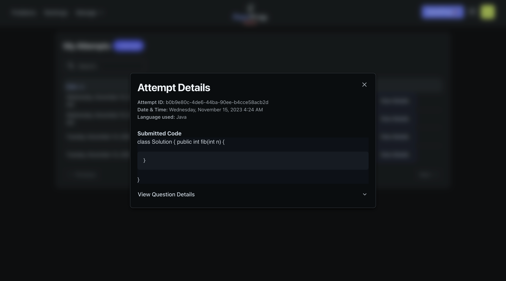

# Peerprep Webpage Service

Contains client-side code for the PeerPrep web application.

## Table of Contents

- [Build Script](#build-script)
- [Architecture](#architecture)
- [Docker Images](#docker-images)
   - [API](#api)
   - [API (Docker)](#api-docker)
- [Deployment](#deployment)
   - [Kubernetes Deployment](#kubernetes-deployment)
   - [Docker Compose Deployment](#docker-compose-deployment)
- [Configuration](#configuration)
- [Prerequisites](#prerequisites)
- [Usage](#usage)
- [Folder Structure](#folder-structure)
- [Technologies Used](#technologies-used)
- [Features](#features)
   - [Sign Up](#sign-up)
   - [Login](#login)
   - [Account Management](#account-management)
   - [Problems](#problems)
   - [View Problem Details](#view-problem-details)
   - [PeerPrep](#peerprep)
   - [Collaboration in Rooms](#collaboration-in-rooms)
     - [Chat](#chat)
     - [Attempts History](#attempts-history)
     - [View Attempt Details](#view-attempt-details)
   - [Rankings](#rankings)
   - [Question Management (Admin only)](#question-management-admin-only)
     - [Create Question](#create-question)
     - [Edit Question](#edit-question)
     - [Delete Question](#delete-question)
   - [Others](#others)
     - [Dark/Light Mode](#darklight-mode)

## Build Script

`build_images.sh` is a build script for building the Docker images and optionally pushing them to the container registry. To get more information about the script, run:

```
./build_images.sh -h
```

## Architecture


## Docker Images

### API

**Name:** ghcr.io/cs3219-ay2324s1-g04/peerprep_user_service_api

**Description:** Runs the API server which serves the static webpage content. This is the image to be used for production deployment via Kubernetes.

### API (Docker)

**Name:** ghcr.io/cs3219-ay2324s1-g04/peerprep_webpage_service_api_docker

**Description:** Runs the API server which serves the static webpage content. This is the image to be used for deployment via Docker compose.

## Deployment

### Kubernetes Deployment

This is the main deployment method for production.

**Prerequisite**

- Docker images must be pushed to the container registry and made public.
  - To push to the container registry (assuming one has the necessary permissions), run: `./build_images.sh -p`
  - To make the images public, change the visibility of the image on [GitHub](https://github.com/orgs/CS3219-AY2324S1-G04/packages).
- Kubernetes cluster must be setup as specified in the [main repository](https://github.com/CS3219-AY2324S1/ay2324s1-course-assessment-g04/blob/master/project/project.md#g04-project).

**Steps:**

1. Ensure the "peerprep" namespace has been created: `kubectl create namespace peerprep`
2. Navigate to the "kubernetes" directory: `cd kubernetes`
3. Deploy the Kubernetes objects: `./deploy.sh`
    - To delete the Kubernetes objects, run: `./delete.sh`

### Docker Compose Deployment

This is intended for development use only. It is meant to make developing other services easier.

**Note:**

- No horizontal auto scaling is provided.
- Make sure that the all services are up.
- The container for the API is not exposed and must be accessed through the Gateway Service.

**Prerequisite**

- Docker images must be built.
  - To build the images, run: `./build_images.sh`

**Steps:**

1. Ensure that the "peerprep" network exist: `docker network create -d bridge peerprep`
2. Create the docker containers: `docker compose up`
    - To delete the docker containers, run: `docker compose down`


## Configuration

The app uses environment variables for configuration. Update the .env files with the necessary values.

## Prerequisites

- Node.js v18 and above (you can change the version using [NVM](https://tecadmin.net/install-nvm-macos-with-homebrew/) or [Homebrew](https://www.denisbouquet.com/change-node-version-using-homebrew/))

## Usage

The PeerPrep webapp is built using React and Vite. Remember to install Node.js with the correct version and node package dependencies to begin.

```bash
npm install
# then 
npm run dev
```

Visit [http://localhost:5173/](http://localhost:5173/) in your browser.

## Folder Structure

Brief rundown of key folders and files of the webapp

- /src: Source code files
  - /components: Common Reusable React components
  - /context: Redux store init functions
  - /features: Grouped components by feature with their necessary redux handlers and types
    - /sampleFeature: All files within this folder are related to the specified feature name
      - /components: Reusable React components
      - sagas.ts: Redux saga functions
      - selectors.ts: Redux store state selectors
      - slice.ts: Redux store reducer and actions
      - types.ts: Common types shared
  - /hooks: Custom reusable React hooks used by components
  - /pages: Page React components
  - /services: Grouped functions according to the service it calls
  - /utils: Utility or helper functions
    - /constants: Files that export constants that are shared throughout the app
    - /theme: Theme override configs
  - App.tsx: Root Parent React Component
  - index.css: Global css styles
  - main.tsx: ReactDOM initialisation (Entry point of app)
  - vite-env.d.ts: Vite env configs
- /public: Public static assets
- .env: Environment files
- vite.build.config.ts: Vite build configs
- vite.config.ts: Vite configs
- index.html: Static html file where JavaScript bundle is built by Vite is referenced

## Technologies Used
- [Vite](https://vitejs.dev/): Development Server and bundler
- [React](https://react.dev/): Front-end framework
- [Redux](https://redux.js.org/): Global state manager
  - [Redux Saga](https://redux-saga.js.org/): Middleware that extends Redux as the state manager
- [React-Router](https://reactrouter.com/en/main): Handles application routes
- [Joy UI](https://mui.com/joy-ui/getting-started/): React UI framework

## Features
### Sign Up
Guests are can sign up with a new account.


### Login
Users can login with their respective account credentials.


### Account Management
Users can manage their account information
- Updating profile info
- Updating password
- Deleting Account (Admins are not able to do this)


### Problems
Users or guests can see the problems page for a full list of all problems. The table can be filtered by complexity or category and sorted accordingly. The searchbar can also be used to search for specific questions.


### View Problem details
Users can to view a specific problem and its full details.


### PeerPrep
Users can PeerPrep and attempt a problem with a peer. This can be done through the PeerPrep button in Problems Page or QuickPrep. 

Before joining a queue, they must specify their problem settings first. However, if QuickPrep was selected problem settings are randomised and the user can instantly join the queue.


Users can also leave a queue


### Collaboration in rooms
Matched users are able to code together in real time with the problem's code template(if any).


#### Chat
Users in rooms are also able to chat with each other through the chat button.


#### Attempts History
Users are able to see a full list of their past attempts. The searchbar can be used to search for specific attempts.


##### View Attempt details
Users can also see the full details of their attempt, including the code submitted and question details.


### Rankings
Users or guests are able to see the rankings page. Rankings are based on the attempt count of each user.


### Question Management (Admin only)
Question management functions are only accessible for admins.
#### Create Question
Admins can create questions and add on necessary code templates.


#### Edit Question
Admins can edit questions.


#### Delete Question
Admins can delete questions. This prevents users from attempting this question.


### Others
#### Dark/Light mode
Users or guests can use the app in light or dark mode by clicking on the mode icon on the top right of the navigation bar.

